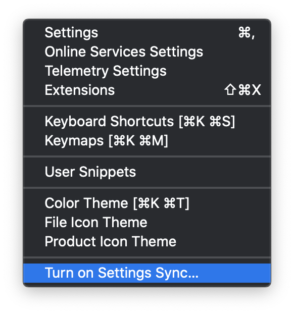

# vscode settings

### setup

[settings-gist](https://gist.github.com/dfarrel1/a6bd450e6ce1355890c6c8bfafb737f3)

using plugin: [settings-sync](https://marketplace.visualstudio.com/items?itemName=Shan.code-settings-sync)

needs github personal access token
gist id: a6bd450e6ce1355890c6c8bfafb737f3

---------------

### turn on settings sync

... and follow the prompts

---------------

Shortcuts
1. Upload Key : Shift + Alt + U
2. Download Key : Shift + Alt + D

(on macOS: Shift + Option + U / Shift + Option + D)

custom key binding
settings json file: shift+alt+cmd+p
